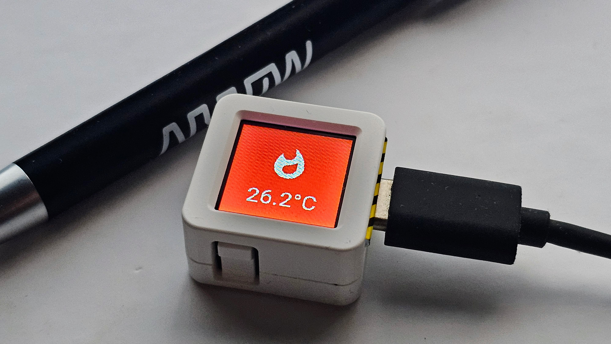

# ESPHome: AtomS3 Status Display
Display any text on the AtomS3 display!

This project provides an ESPHome configuration for the M5Stack AtomS3, allowing you to show your devices' statuses on the display. You can dynamically change the text, icon, and background color.




## Features

- **Display Text:** Update the text displayed on the screen.
- **Display Icon:** Choose from a wide range of Material Design Icons to show on the display.
- **Display Color:** Set the background color of the display. The text and icon color will automatically adjust for contrast.
- **Button Trigger:** The built-in button can be used to trigger actions in Home Assistant (e.g., toggle a light).

## Hardware

- [M5Stack AtomS3](https://shop.m5stack.com/products/atoms3-esp32s3-dev-kit)

## Configuration

The project is configured using several YAML files:

- `atoms3-display.yaml`: The main ESPHome configuration file.
- `secrets.yaml`: Used to store your WiFi credentials. You will need to create this file.
- `fonts.yaml`: Defines the fonts used for the display text and icons.
- `home_icons.yaml`: Maps friendly names to the Material Design Icon glyphs.

## Quick Start

To get started with this project, you will need to have ESPHome installed.

1.  **Clone this repository or download the files.**

2.  **Create a `secrets.yaml` file** in the same directory with your WiFi credentials:
    ```yaml
    wifi_ssid: "YOUR_WIFI_SSID"
    wifi_password: "YOUR_WIFI_PASSWORD"
    ```

3.  **Install and flash the configuration to your AtomS3:**
    You can use the ESPHome command-line tool to flash your device.

    ```bash
    esphome run atoms3-display.yaml
    ```
    This command will compile the firmware, connect to your device, and upload the firmware.

4.  **Add the device to Home Assistant:**
    Once flashed, Home Assistant should automatically discover the new device. You can also add it manually via the ESPHome integration.


## Resources

- **ESPHome:** [https://esphome.io/](https://esphome.io/)
- **M5Stack AtomS3:** [https://shop.m5stack.com/products/atoms3-esp32s3-dev-kit](https://shop.m5stack.com/products/atoms3-esp32s3-dev-kit)
- **Material Design Icons:** The icons used in this project are from the Material Design Icons [Google Material Icons](https://fonts.google.com/icons).
- AI for speed ;)
